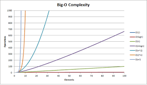

# 시간복잡도 유형 ❗️

- 빅-오메가(Ω(n)) : 최선일 때(best case)의 연산 횟수를 나타낸 표기법
- 빅-세타(θ(n)) : 보통일 때(average case)의 연산 횟수를 나타낸 표기법
- 빅-오(O(n)) : 최악일 때(worst case)의 연산 횟수를 나타낸 표기법

> 일반적으로 수행 시간은 **1억 번의 연산을 1초**로 간주한다.

```java
public class TimeComplexityExample {
    public static void main(String[] args) {
        int randomNum = (int)(Math.random() * 100);

        for(int i=0; i<100; i++) {
            if(i==randomNum) {
                System.out.println(i+1);
                break;
            }
        }
    }
}

```

위 코드는 1~100 사이의 무작윗값을 찾아 출력하는 코드이다. 빅-오메가는 1번 (랜덤 값이 0일 때), 빅-세타는 50번 (2/N번, 1~100 평균이 50), 빅-오는 100번 (N번, 랜덤 값이 99일 때)

> 코딩테스트는 빅-오 표기법(O(n))을 기준으로 수행 시간을 계산하는 것이 보통이다.
> 다양한 테스트 케이스를 수행해 모든 케이스를 통과해야하기 때문이다.



위 사진을 보면 **n(주어진 데이터 값)의 증가에 따라 성능(수행 시간)** 이 어떻게 다른 지를 확인 할 수 있다.

> 예를 들어 n이 100,000일 때, 1초 안에 수행 되어야 하는 과제가 주어진다면 O(n), O(nlogn)통과, O(n^2)는?
> 100,000 \* 100,000 = 10,000,000,000, 100억 번 수행되니깐 통과를 못 한다.
> 왜냐하면 우리는 **1억 번이 수행 시간 1초**로 생각하기 때문에

## 수 정렬하기

N개의 수가 주어졌을 때 이를 오름차순 정렬하는 프로그램을 작성하시오.

💬 입력

1번째 줄에 수의 개수 N(1 ≤ N ≤ 1,000,000), 2번째 줄부터는 N개의 줄에 숫자가 주어진다. 이 수는 절댓값이 1,000,000보다 작거나 같은 정수다. 수는 중복되지 않는다.

💬 출력

1번째 줄부터 N개의 줄에 오름차순 정렬한 결과를 1줄에 1개씩 출력한다.

> 예제입력 1

5 <br>
5 <br>
2 <br>
3 <br>
4 <br>
1 <br>

> 예제출력 1

1 <br>
2 <br>
3 <br>
4 <br>
5 <br>

> 풀이

- 적합 알고리즘을 찾아야한다.
- 1,000,000을 빅-오 표기법에 대입하자.
- O(n) : 1,000,000 < 1초
- O(nlogn) : 1,000,000log1,000,000 = 약 20,000,000 < 1초
- O(n^2) : 1,000,000 \* 1,000,000 > 2초 (부적합)

# 결론

1. 주어진 수(N)를 보고 빅-오 표기법을 이용하여 중복문을 얼마나 사용할 지 예상
2. 알고리즘별 시간 복잡도를 생각하여 알고리즘 유추하기
